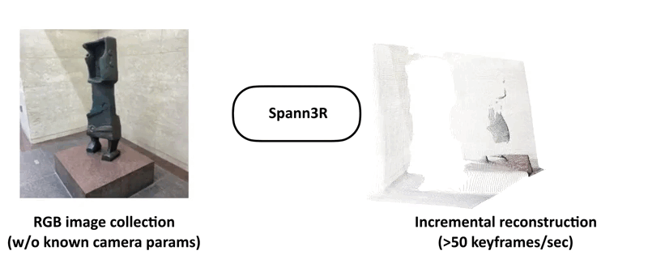

# 3D Reconstruction with Spatial Memory

### [Paper](https://arxiv.org/abs/2408.16061) | [Project Page](https://hengyiwang.github.io/projects/spanner) | [Video](https://hengyiwang.github.io/projects/spanner/videos/spanner_intro.mp4)

> 3D Reconstruction with Spatial Memory <br />
> [Hengyi Wang](https://hengyiwang.github.io/), [Lourdes Agapito](http://www0.cs.ucl.ac.uk/staff/L.Agapito/)<br />
> arXiv 2024

<p align="center">
  <a href="">
    
  </a>
</p>

## Update

[2024-10-25] Add support for [Nerfstudio](assets/spanner-gs.gif)

[2024-10-18] Add camera param estimation

[2024-09-30] [@hugoycj](https://github.com/hugoycj) adds a gradio demo

[2024-09-20] Instructions for datasets [data_preprocess.md](docs/data_preprocess.md)

[2024-09-11] Code for Spann3R

## Installation

1. Clone Spann3R

   ```
   git clone https://github.com/HengyiWang/spann3r.git
   cd spann3r
   ```
   
2. Create conda environment

   ```
   conda create -n spann3r python=3.9 cmake=3.14.0
   conda install pytorch==2.3.0 torchvision==0.18.0 torchaudio==2.3.0 pytorch-cuda=11.8 -c pytorch -c nvidia  # use the correct version of cuda for your system
   
   pip install -r requirements.txt
   
   # Open3D has a bug from 0.16.0, please use dev version
   pip install -U -f https://www.open3d.org/docs/latest/getting_started.html open3d
   ```

3. Compile cuda kernels for RoPE

   ```
   cd croco/models/curope/
   python setup.py build_ext --inplace
   cd ../../../
   ```

4. Download the DUSt3R checkpoint

   ```
   mkdir checkpoints
   cd checkpoints
   # Download DUSt3R checkpoints
   wget https://download.europe.naverlabs.com/ComputerVision/DUSt3R/DUSt3R_ViTLarge_BaseDecoder_512_dpt.pth
   ```

5. Download our [checkpoint](https://drive.google.com/drive/folders/1bqtcVf8lK4VC8LgG-SIGRBECcrFqM7Wy?usp=sharing) and place it under `./checkpoints`

## Demo

1. Download the [example data](https://drive.google.com/drive/folders/1bqtcVf8lK4VC8LgG-SIGRBECcrFqM7Wy?usp=sharing) (2 scenes from [map-free-reloc](https://github.com/nianticlabs/map-free-reloc)) and unzip it as `./examples`

2. Run demo:

   ```
   python demo.py --demo_path ./examples/s00567 --kf_every 10 --vis --vis_cam
   ```

   For visualization `--vis`, it will give you a window to adjust the rendering view. Once you find the view to render, please click `space key` and close the window. The code will then do the rendering of the incremental reconstruction.
   
3. Nerfstudio:

   ```
   # Run demo use --save_ori to save scaled intrinsics for original images
   python demo.py --demo_path ./examples/s00567 --kf_every 10 --vis --vis_cam --save_ori
   
   # Run splatfacto
   ns-train splatfacto --data ./output/demo/s00567 --pipeline.model.camera-optimizer.mode SO3xR3
   
   # Render your results
   ns-render interpolate --load-config [path-to-your-config]/config.yml
   ```

   Note that here you can use `--save_ori` to save the scaled intrinsics into `transform.json` to train NeRF/3D Gaussians with original images.'


## Gradio interface 

We also provide a Gradio interface for a better experience, just run by:

```bash
# For Linux and Windows users (and macOS with Intel??)
python app.py
```

You can specify the `--server_port`, `--share`, `--server_name` arguments to satisfy your needs!


## Training and Evaluation

### Datasets

We use Habitat, ScanNet++, ScanNet, ArkitScenes, Co3D, and BlendedMVS to train our model. Please refer to [data_preprocess.md](docs/data_preprocess.md).

### Train

Please use the following command to train our model:

```
torchrun --nproc_per_node 8 train.py --batch_size 4
```

### Eval

Please use the following command to evaluate our model:

```
python eval.py
```


## Acknowledgement 

Our code, data preprocessing pipeline, and evaluation scripts are based on several awesome repositories:

- [DUSt3R](https://github.com/naver/dust3r)
- [SplaTAM](https://github.com/spla-tam/SplaTAM)
- [NeRFStudio](https://github.com/nerfstudio-project/nerfstudio)
- [MVSNet](https://github.com/YoYo000/MVSNet)
- [NICE-SLAM](https://github.com/cvg/nice-slam)
- [NeuralRGBD](https://github.com/dazinovic/neural-rgbd-surface-reconstruction)
- [SimpleRecon](https://github.com/nianticlabs/simplerecon)

We thank the authors for releasing their code!

The research presented here has been supported by a sponsored research award from Cisco Research and the UCL Centre for Doctoral Training in Foundational AI under UKRI grant number EP/S021566/1. This project made use of time on Tier 2 HPC facility JADE2, funded by EPSRC (EP/T022205/1).

## Citation

If you find our code or paper useful for your research, please consider citing:

```
@article{wang20243d,
  title={3D Reconstruction with Spatial Memory},
  author={Wang, Hengyi and Agapito, Lourdes},
  journal={arXiv preprint arXiv:2408.16061},
  year={2024}
}
```

